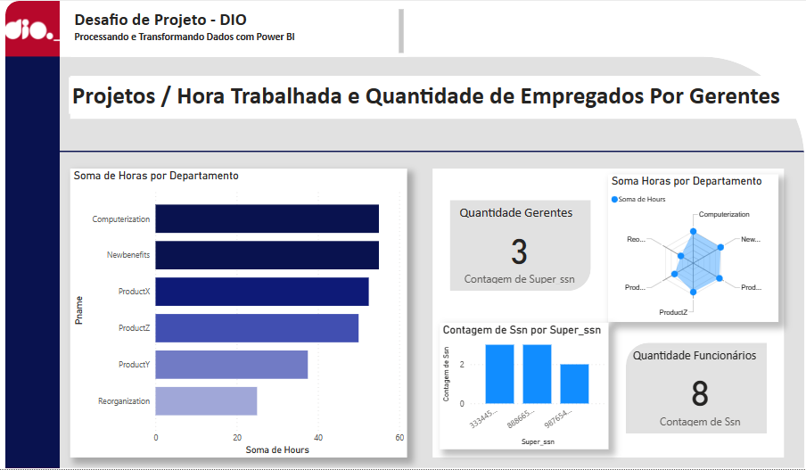
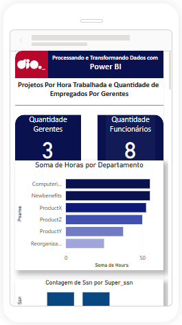

<div text-align="justify">
    <figure>
    
  </figure>
    <h1>Processando e Transformando Dados com Power BI</h1>
</div>
<div align="center">
  
</div>
<div>
    <h3>DIO - Desafio de Projeto</h3>
    <p><strong>Objetivo Geral:</strong></p>
    <ul>
        <li>Configurar o setup de banco de dados na Azure</li>
        <li>Popular o servidor com script fornecido</li>
        <li>Integrar o MySQL com Power BI</li>
        <li>Realizar as transformações indicadas</li>
    </ul>
    <hr>
    <h3>Na visualização prévia foi possível encontra algumas mudaças necessárias:</h3>
    <ol>
        <li>O Employee James E Borg possuia valor <i>nulo</i> para <i>Super_ssn</i>. Observando os departamentos foi possível idenfificar que o dado não foi preenchido porque o próprio funcionário é o gerente.</li>
        <li>Também já na pré-visualização foi possivel encontrar mais um ponto em que uma atualização foi requisitada. A junção de colunas para que os nomes dos funcionários ficassem em uma única coluna. Através da função <i>Mesclar Colunas</i> foi possível juntar Fname, Minit e Last name em uma coluna <i>Employee_name</i>.</li>
    </ol>
    <h3>Analisando os dados mais profundamente foi possível realizar as seguintes mudanças:</h3>
    <ul>
        <li>Todos os funcionários com seus respectivos departamentos e gerentes.</li>
        <li>Todos os dados nulos foram tratados.</li>
        <li>Todas colunas desnecessárias foram removidas</li>
        <li>Todo departamento tem seu gerente designado.</li>
    </ul>
    
<p>Os tipos dos dados foram atualizados, e.x. <i>Salary</i> de Números Inteiros agora possui Número Decimal Fixo.</p>
<p>À partir das colunas "Datas", com a função <i>Data</i> foi possível separar e criar colunas para dia, mês e ano. O mesmo para as colunas de endereço. Através da função <i>Dividir Colunas por Delimitador</i>, número, logradouro e UF foram separados em colunas.</p>
    <p>A tabela <strong>Employee_Department</strong> foi criada através da mescla das respectivas tabelas. As colunas redundantes foram removidas. </p>
    <p>Outra tabela, a <strong>Dept_Name_By_Location</strong> foi gerada à partir da mescla das tabelas <i>Department</i> e <i>Dept_location</i>. A utilização da função de <i>"Mescla"</i> para essa situação se deu pela diferença de propósito em relação a função <i>"Atribuir"</i>. A grande diferenca entre as duas é que a função Mesclar no Power BI é usada para combinar duas ou mais tabelas com base em colunas relacionadas. É semelhante a um JOIN em SQL. Enquanto a função Atribuir permite que se atribua usuários a funções (neste caso: departamento à localizações), seja individualmente ou em grupo.</p>
</div>

<div align="center">
    <h3>Relatório Web</h3>
  
    <h3>Relatório Mobile</h3>
  
</div>

<div>
    <h3>Diferença entre Combinar e Mesclar consultas</h3>
    <p>No Power BI, existem duas maneiras de combinar consultas: <strong>Acrescentar Consultas</strong> e <strong>Mesclar Consultas</strong>.</p>
    <p>A operação de <i>Acrescentar Consultas</i>  consiste em pegar os resultados de duas ou mais consultas e transformá-los em uma só consulta contendo todos os resultados de cada uma das tabelas/consultas utilizadas no processo . Por exemplo, se uma consulta tiver 50 linhas e a outra consulta tiver 100 linhas, a operação criará uma nova consulta com 150 linhas.</p>
    <p>Já a operação de <i>Mesclar Consultas</i> une duas tabelas existentes com base em valores correspondentes de uma ou várias colunas. Você pode optar por usar diferentes tipos de junções, dependendo da saída desejada.</p>
    <h3>Funcionários organizados por gerentes:</h3>
    <p>No relatório foram criados gráficos de barras e de àrea para demonstrar a proporção de funcionários por gerente e cartões com suas respectivas contagem. Também há a seguinte query para uma pesquisa no banco de dados: </p>
</div>

```
SELECT m.Fname AS Manager, CONCAT(e.Fname, ' ', e.Minit, ' ', e.Lname) AS Employee, e.Salary, e.Dno
            FROM employee e 
            LEFT OUTER JOIN employee m
            ON e.Super_ssn = m.Ssn
            ORDER BY Manager;
```

<footer>
  <div class="logotipo" align="right">
    <figure>
      
    </figure>
  </div>
  <div class="small-subtitle" align="right">
    <p><small><i>Formação DIO.</i></small></p>
  </div>
</footer>
