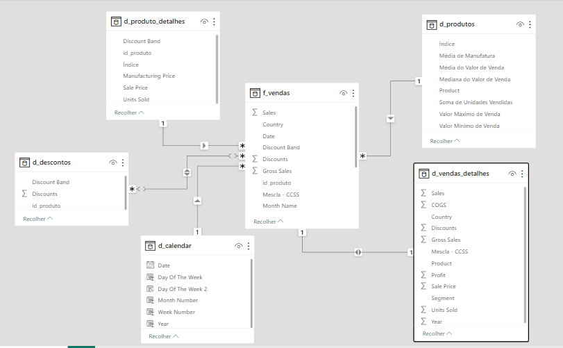

    <figure>
    
  </figure>
    <h1>Star Schema para Financial</h1>

    <h3>DIO - Desafio de Projeto</h3>
     
    
Utilizar a tabela única de Financial Sample para criar as tabelas dimensão e fato do nosso modelo baseado em star schema.

    
O processo consiste na criação das tabelas com base na tabela original. A partir da cópia serão selecionadas as colunas que irão compor a visão da nova tabela. Sendo assim, a partir da tabela principal serão criadas as tabelas:

    <ul>
      <li>D_Produtos (ID_produto, Produto, Média de Unidades Vendidas, Médias do valor de vendas, Mediana do valor de vendas, Valor máximo de Venda, Valor mínimo de Venda).</li>
      <li>D_Produtos_Detalhes(ID_produtos, Discount Band, Sale Price, Units Sold, Manufactoring Price</li>
      <li>D_Descontos (ID_produto, Discount, Discount Band)</li>
      <li>D_Detalhe (vendas_detalhes): Sales, COGS, Country, Discounts, Gross Sales, Product, Profit, Sale Price, Segment, Units Sold e Year.</li>
      <li>D_Calendário – Criada por DAX com calendar(): Date, Day of the Week, Day Of The Week 2, Month Number, Week Number e Year.</li>
      <li>F_Vendas (SK_ID , ID_Produto, Produto, Units Sold, Sales Price, Discount Band, Segment, Country, Salers, Profit, Date (campos))</li>
    </ul>
  
O relacionamento entre a tabela <strong>f_vendas</strong> e a tabela <strong>d_calendar</strong>foi gerado através da mescla, em ambas tabelas, das colunas "Product", "Country", "Segment" e "Sales", que gerou a coluna "Mescla - PCSS", que se tornou denominador comum para a relatção entre as tabelas.

  

    <h3>Financial Star Schema</h3>
    
    
Acesse o <a href="https://github.com/83Rafa/power_bi_analyst/blob/main/desafio_de_projeto_5/financial.pbix">arquivo.pbix</a>

     
  

<footer>
  

    <figure>
      
    </figure>
  

  

    
<small><i>Formação DIO.</i></small>

  

</footer>
