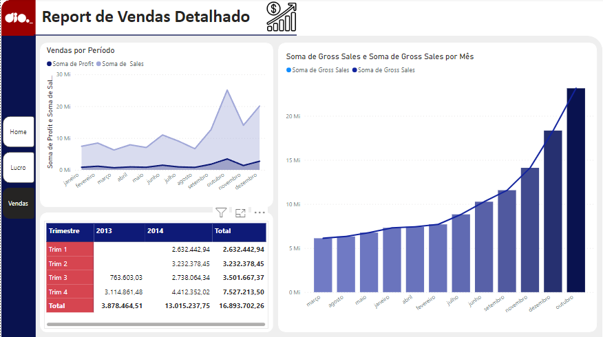

    <figure>
    
  </figure>
    <h2>Relatório Financeiro com Foco na Experiência do Usuário</h2>

    <h4>DIO - Desafio de Projeto</h4>
     
    
Modificar o relatório criativo - o primeiro relatório com base na sample financials - focando na experiência do usuário. Além disso, levar em consideração os seguintes pontos:

    <ul>
      <li> Posicionamento</li>
      <li>Contraste</li>
      <li>Proporção Áurea</li>
      <li>Segmentação dos Dados</li>
     </ul>
  
Próximos passos:

  <ul>
      <li>Insirir os botões de navegabilidade</li>
      <li>Modificar a segunda página</li>
      <li>Modifique os botões de navegabilidade a fim de destacar o focalizar e selecionar</li>
      <li>Criar os menus de navegabilidade em cada página</li>
      <li>O relatório é composto por 3 página</li>
     </ul>

  

    <h3>Home</h3>
    
    <h3>Lucro</h3>
    
    <h3>Vendas</h3>
    
    
Acesse o <a href="https://github.com/83Rafa/power_bi_analyst/blob/main/desafio_de_projeto_6/Sales%20Report%20User%20Experiance.pbix">arquivo.pbix</a>

     
  

<footer>
  

    <figure>
      
    </figure>
  

  

    
<small><i>Formação DIO.</i></small>

  

</footer>
