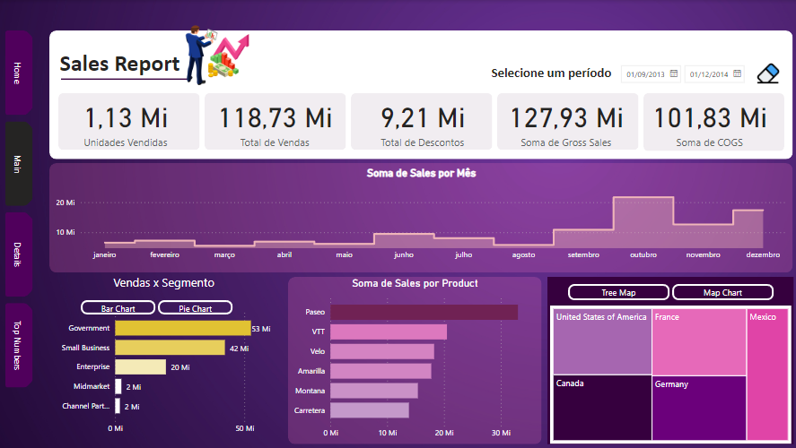
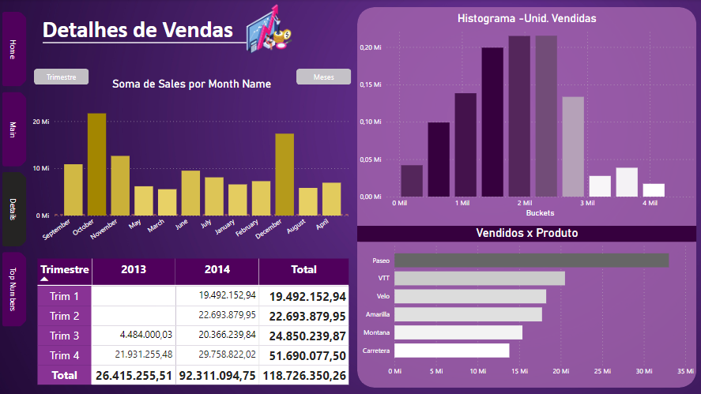
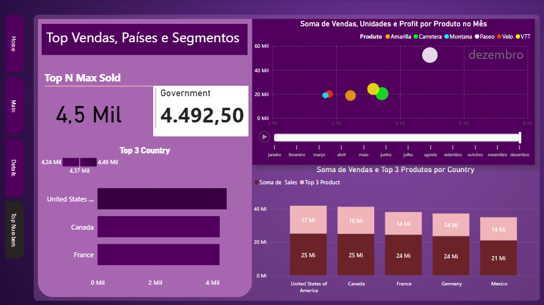
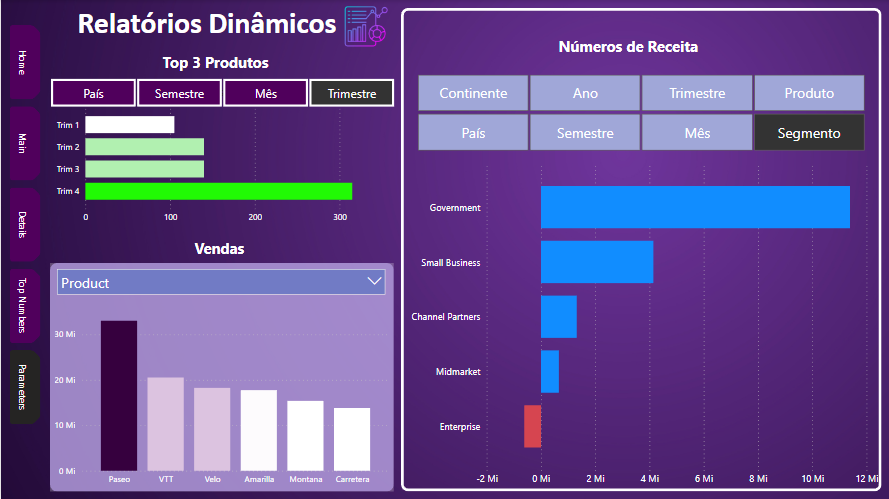

    <figure>
    
  </figure>
    <h1>Relatórios Dinâmicos Com Parâmetros No Power BI</h1>

    <h4>DIO - Desafio de Projeto</h4>
    
O relatório possui 3 gráficos: <strong>Números de Receita</strong>, <strong>Vendas</strong> e <strong>Top 3 Produtos</strong>. Através dos menús dinâmicos com diversos parâmetros, o usuário pode escolher pontos de vista distintos e obter, em uma única página, inúmeras combinações de dados.

    
Ex.: <i>Receita por Produto, Segmento, Ano, Semestre, Trimestre, Mês, Continente e País</i>. Tudo em um único gráfico. Assim, combinações com outros parâmetros dos outros dois gráficos podem apresentar uma visão ampla dos números da empresa.

    <h3>Criação de visuais considerando a criação de parâmetros.</h3>
    
As diretrizes são:

  <ul>
      <li><strong>Primeira visão:</strong> parâmetro com base em categorias</li>
      <li><strong>Segunda visão:</strong> parâmetros com base em valores (profit, sales, ou outros)</li>
      <li>Seguir a mesma estilização do relatório</li>
      <li>Criar uma história para apresentar essa visão sobre os dados</li>
     </ul>

    

        
        
        
    

    <h3>Relatório Dinâmico</h3>
    
    
Acesse o <a href="https://github.com/83Rafa/power_bi_analyst/blob/main/desafio_de_projeto_8/Relatorios_Dinamicos_Com_Parametros.pbix">arquivo.pbix</a>

     

  

<footer>
  

    <figure>
      
    </figure>
  

  

    
<small><i>Formação DIO.</i></small>

  

</footer>
